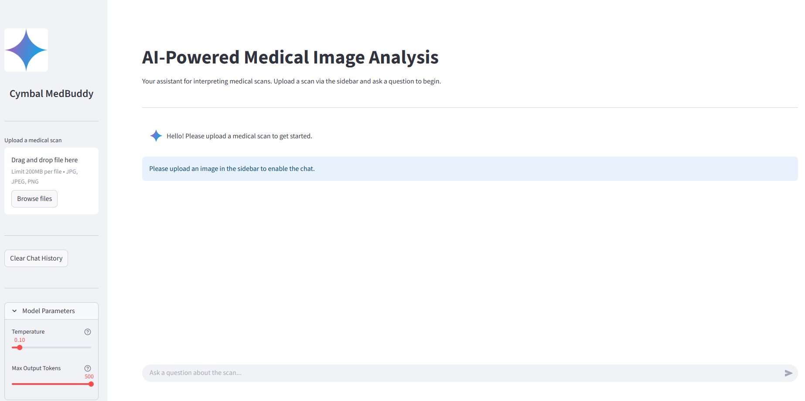
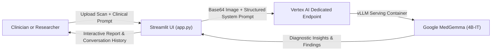
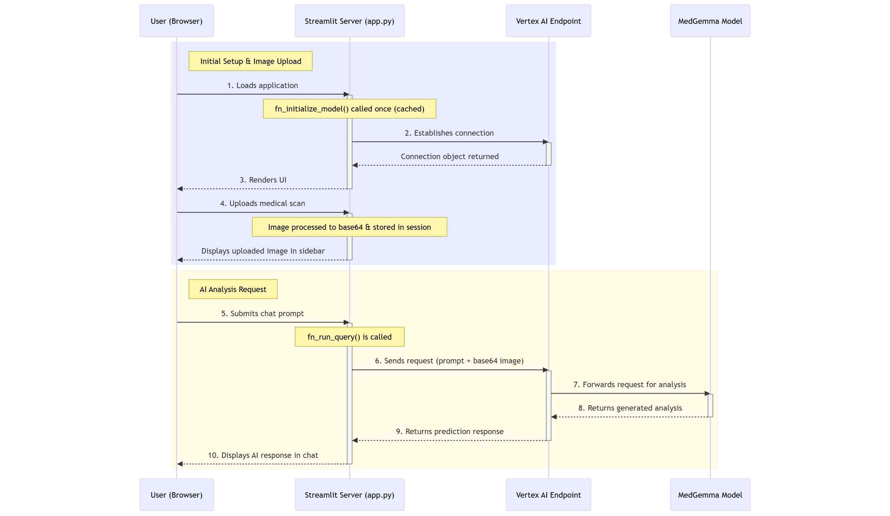
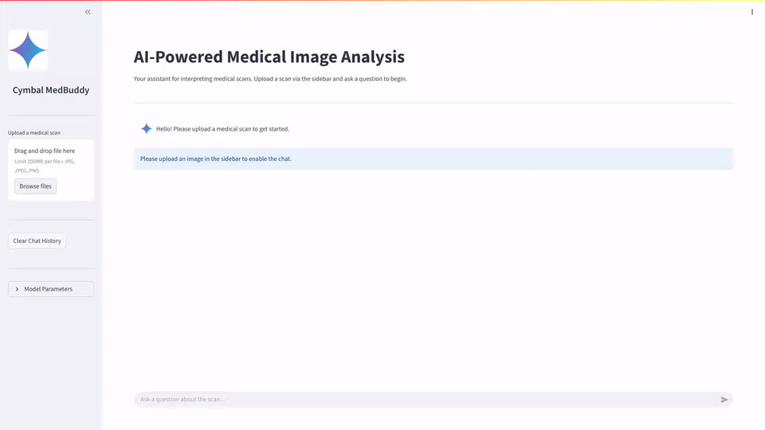
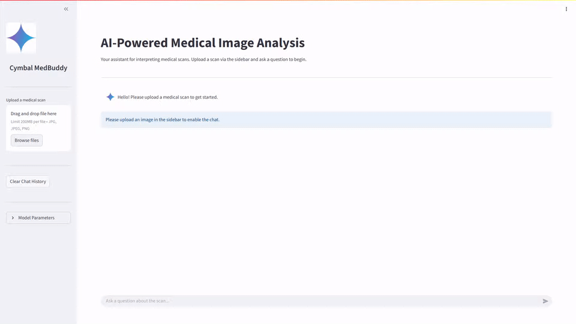
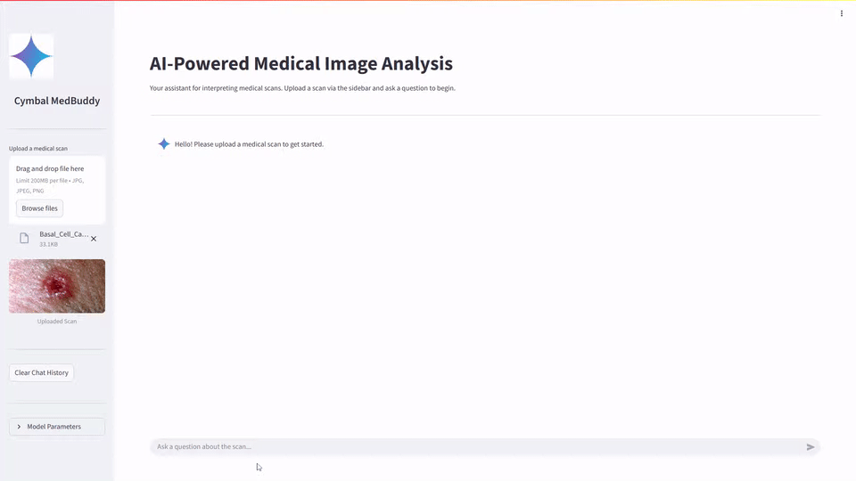

# Cymbal MedBuddy: AI-Powered Medical Image Analysis

[](https://github.com/Rajdipc/medgemma-cymbal-medbuddy/releases)
[](https://cloud.google.com/)
[](https://cloud.google.com/vertex-ai)
[](https://deepmind.google/models/gemma/medgemma/)
[](https://github.com/vllm-project/vllm)
[](https://cloud.google.com/compute/docs/gpus)
[](https://streamlit.io/)
[](https://www.python.org/)
[](https://medium.com/google-cloud/analyze-medical-images-with-medgemma-a-technical-deep-dive-fee0be18e7e0)

`#MedGemma` &nbsp;•&nbsp; `#VertexAI` &nbsp;•&nbsp; `#HealthcareAI` &nbsp;•&nbsp; `#MedicalImaging` &nbsp;•&nbsp; `#Radiology` &nbsp;•&nbsp; `#MultimodalAI` &nbsp;•&nbsp; `#Streamlit` &nbsp;•&nbsp; `#Gemma` &nbsp;•&nbsp; `#GoogleCloud` &nbsp;•&nbsp; `#ModelGarden` &nbsp;•&nbsp; `#DeepMind` &nbsp;•&nbsp; `#vLLM` &nbsp;•&nbsp; `#Python`

---

**A multi-modal Streamlit application leveraging Google's MedGemma vision-language foundation model on Vertex AI for real-time conversational analysis of medical scans.**



> [!IMPORTANT]
> **Clinical & Research Disclaimer:** Cymbal MedBuddy is developed strictly for **research, demonstration, and educational purposes**. MedGemma is not certified as a medical device by the FDA, CE, or other health regulatory authorities, and is **not intended for clinical diagnosis, treatment planning, or direct patient care**. Always consult qualified healthcare professionals for medical decisions.

---

## 📖 Overview

Cymbal MedBuddy is a multi-modal AI clinical assistant designed to aid radiologists, medical researchers, and students in the interpretation of diagnostic images. Users can upload a variety of medical scans (X-rays, MRIs, CT scans, histopathology slides, and dermatological images) and engage in an interactive chat to query specific anatomical features or anomalies. The application combines visual data from the scan with user prompts to generate detailed, clinically relevant insights.

The backend is powered by **MedGemma** (`google/medgemma@medgemma-4b-it`), an open medical foundation model from Google DeepMind, deployed on a dedicated **Vertex AI Endpoint** accelerated by `2 x NVIDIA L4` GPUs with high-throughput **vLLM** serving. The frontend is an interactive, responsive web interface built with **Streamlit**.

📰 **Technical Deep Dive:** Read the comprehensive architecture breakdown published in Google Cloud Community on Medium:  
👉 **[Analyze Medical Images with MedGemma: A Technical Deep Dive](https://medium.com/google-cloud/analyze-medical-images-with-medgemma-a-technical-deep-dive-fee0be18e7e0)**

---

## 📂 Project Structure

```text
.
├── .gcloudignore                        # Files excluded from Google Cloud deployments
├── .gitignore                           # Git ignore rules
├── .env                                 # Environment variables (Project ID, Endpoint ID, Regions)
├── app.py                               # Core Streamlit application script with cached client & chat logic
├── images/
│   ├── app/                             # UI icons and assistant avatars
│   ├── docs/                            # Documentation diagrams, screenshots, and walkthrough GIFs
│   └── sample_medical_images/           # Curated medical scans for immediate evaluation
├── README.md                            # Architecture documentation and deployment guide
└── requirements.txt                     # Python dependencies
```

---

## ✨ Key Features

- **Multi-Modal Diagnostic Chat:** Accepts diagnostic images alongside free-form clinical queries for contextual analysis.
- **Specialized Medical Foundation Model:** Powered by Google's `MedGemma-4B-IT`, fine-tuned for medical reasoning and radiology domain expertise.
- **High-Throughput vLLM Serving:** Deployed using Vertex AI Model Garden's optimized `pytorch-vllm-serve` container on NVIDIA L4 GPUs.
- **Tunable Model Hyperparameters:** Real-time UI sliders to adjust `Temperature` (conservatism vs. creativity) and `Max Output Tokens`.
- **Low-Latency Session Caching:** Leverages Streamlit's `@st.cache_resource` to cache Vertex AI endpoint connections across interactions.
- **Conversation Management:** Clear session state or export the full clinical dialogue into a timestamped `.txt` summary.
- **Resilient Error Handling:** Gracefully catches API rate limits, quota limits, and authentication errors with actionable UI alerts.

---

## 🏗️ System Architecture

The application implements a decoupled, cloud-native architecture:



1. **Frontend Layer (Streamlit):** The user accesses the web UI, uploads a scan, adjusts inference parameters, and submits questions.
2. **Application Server (`app.py`):** Encodes the scan into Base64, formats the conversational history, and constructs the clinical system prompt.
3. **Vertex AI Dedicated Endpoint:** Manages autoscaling, TLS termination, and traffic routing to GPU compute nodes (`g2-standard-24`).
4. **Model Serving Runtime:** The `pytorch-vllm-serve` container executes tensor-parallel inference on `google/medgemma@medgemma-4b-it`.

---

## 📊 Workflow Sequence Diagram

The diagram below illustrates the end-to-end data lifecycle from scan upload to final diagnostic rendering:



---

## 🧪 Sample Medical Scans & Test Prompts

The repository includes sample medical scans in [`images/sample_medical_images/`](images/sample_medical_images/) to test the assistant immediately:

| Modality / Image | File Path | Suggested Evaluation Prompt |
|---|---|---|
| **Chest Radiograph (PA View)** | `images/sample_medical_images/chest_xray.jpg` | *"Examine this PA chest radiograph. Are there any signs of focal consolidation, pneumothorax, or cardiomegaly?"* |
| **Brain MRI (Neuro-Oncology)** | `images/sample_medical_images/oligodendrogliona.jpg` | *"Describe the intracranial lesion visible on this axial MRI slice. What are its borders and potential differential diagnoses?"* |
| **Dermatoscopy (Skin Lesion)** | `images/sample_medical_images/Basal_Cell_Carcinoma.jpg` | *"Evaluate the clinical morphology of this dermatological lesion. Note any ulceration, telangiectasia, or irregular borders."* |
| **Histopathology (Biopsy)** | `images/sample_medical_images/high-grade-carcinoma.png` | *"Analyze the cell density, architectural disruption, and nuclear atypia present in this histological section."* |

---

## 🚀 Setup and Deployment Guide

### 1. Prerequisites

- **Google Cloud Project** with active billing.
- **Google Cloud SDK (`gcloud`)** installed and authenticated:
  ```bash
  gcloud auth login
  gcloud config set project <YOUR_PROJECT_ID>
  ```
- **Vertex AI API** enabled in your GCP project.
- **Python 3.10+** and `pip` (or `uv`).

---

### 2. Deploy MedGemma on Vertex AI Model Garden

Deploy `google/medgemma@medgemma-4b-it` using either the Cloud Console or the `gcloud` CLI:

```bash
gcloud ai model-garden models deploy \
  --model="google/medgemma@medgemma-4b-it" \
  --region="us-central1" \
  --project="<YOUR_PROJECT_ID>" \
  --accept-eula \
  --machine-type="g2-standard-24" \
  --accelerator-type="NVIDIA_L4" \
  --container-image-uri="us-docker.pkg.dev/vertex-ai/vertex-vision-model-garden-dockers/pytorch-vllm-serve:20250430_0916_RC00_maas" \
  --use-dedicated-endpoint \
  --endpoint-display-name="google_medgemma-4b-it-endpoint"
```

Once deployment completes (approx. 10–15 minutes), navigate to **Vertex AI > Endpoints** in the Cloud Console and note your **Endpoint ID** and **Region**.

---

### 3. Configure Environment Variables

Create a `.env` file in the project root:

```env
GCP_PROJECT_ID="your-gcp-project-id"
GCP_REGION="us-central1"
MODEL_ENDPOINT_ID="your-vertex-endpoint-id"
MODEL_ENDPOINT_REGION="us-central1"
```

---

### 4. Local Development

```bash
# 1. Clone the repository
git clone https://github.com/Rajdipc/medgemma-cymbal-medbuddy.git
cd medgemma-cymbal-medbuddy

# 2. Set up virtual environment
python3 -m venv venv
source venv/bin/activate  # On Windows: venv\Scripts\activate

# 3. Install dependencies
pip install -r requirements.txt

# 4. Launch the application
streamlit run app.py
```

---

### 5. Run on Google Cloud Shell

```bash
# Set active project
gcloud config set project <YOUR_PROJECT_ID>

# Clone repository
git clone https://github.com/Rajdipc/medgemma-cymbal-medbuddy.git
cd medgemma-cymbal-medbuddy

# Create virtual environment using uv (pre-installed in Cloud Shell)
uv venv
source .venv/bin/activate
uv pip install -r requirements.txt

# Launch with Web Preview support
streamlit run app.py --server.port=8080 --server.enableCORS=false
```
Click **Web Preview > Preview on port 8080** in Cloud Shell to open the UI.

---

### 6. Production Deployment Options

For production hosting, deploy the Streamlit container using:
- **Cloud Run:** Fully managed serverless container platform with HTTPS, IAM authentication, and autoscaling.
- **App Engine Flexible:** Managed container runtime for persistent web applications.

---

## ⚙️ Code Deep Dive

The core logic is structured in [`app.py`](app.py):

- **`fn_initialize_model()`:** Utilizes Streamlit's `@st.cache_resource` decorator to instantiate the Vertex AI client and endpoint object exactly once per worker process, avoiding expensive reconnection handshakes on UI reruns.
- **`fn_run_query()`:**
  - **System Instruction:** Injects a structured clinical prompt enforcing role constraints (e.g. radiological observation, differential formatting, and certainty guidance).
  - **Payload Composition:** Assembles the multi-modal request combining Base64 image bytes, text prompt history, and inference hyperparameters (`temperature`, `max_output_tokens`).
  - **Fault Tolerance:** Traps `google.api_core` exceptions to display clear recovery advice for auth, quota, or network issues.
- **`st.session_state`:** Preserves chat history, uploaded scan bytes, and custom hyperparameter settings throughout the clinician's session.

---

## 📸 Sample Outputs & Walkthrough

| Diagnostic Session 1 | Diagnostic Session 2 | Diagnostic Session 3 |
|:---:|:---:|:---:|
|  |  |  |

---

## 🔗 References & Official Resources

- [Google DeepMind MedGemma Overview](https://deepmind.google/models/gemma/medgemma/)
- [Google Research Blog: MedGemma](https://research.google/blog/medgemma-our-most-capable-open-models-for-health-ai-development/)
- [Google Health AI Developer Foundations](https://developers.google.com/health-ai-developer-foundations/medgemma)
- [MedGemma Model Card](https://developers.google.com/health-ai-developer-foundations/medgemma/model-card)
- [Vertex AI Model Garden Documentation](https://cloud.google.com/model-garden)
- [Vertex AI Endpoints Deployment Guide](https://cloud.google.com/vertex-ai/docs/general/deployment)
- [Medium Technical Deep Dive Article](https://medium.com/google-cloud/analyze-medical-images-with-medgemma-a-technical-deep-dive-fee0be18e7e0)
